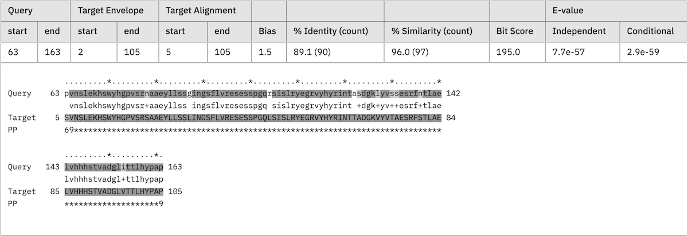
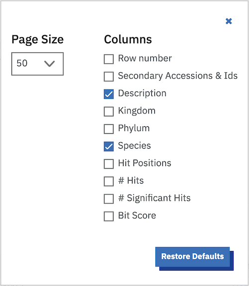
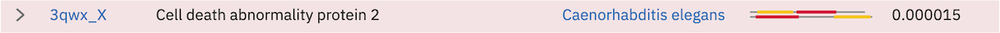
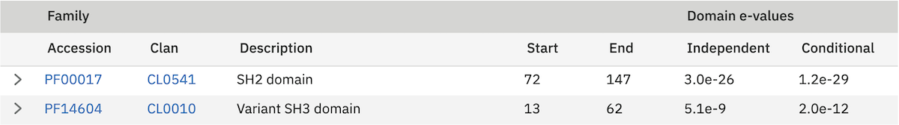
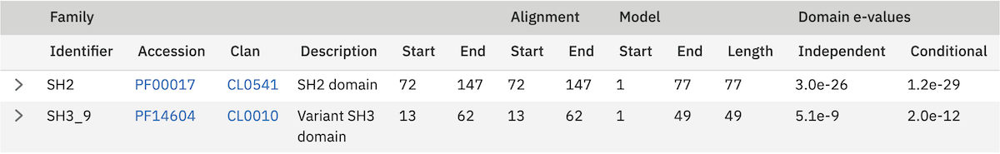
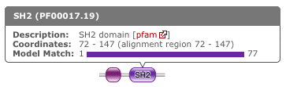
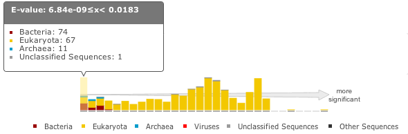
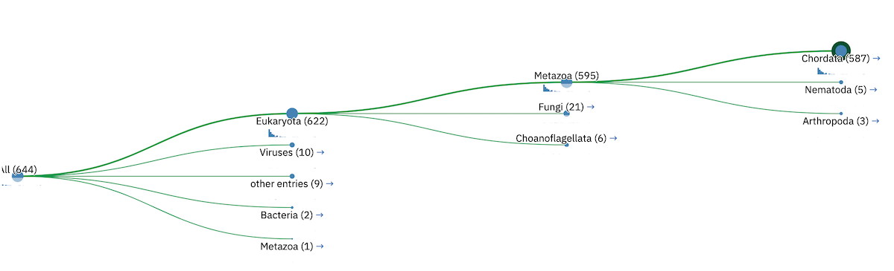
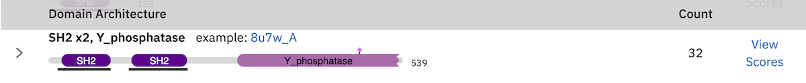

Results
=======

There are three ways of viewing results. The traditional score view is the default,
but all three may be selected via the navigation buttons at the top of the page.

Score view
  The sequences matched are listed in order of decreasing score

Taxonomy view
  The matched sequences are arranged according to the taxonomic lineage of the source organism(s)

Domain view
  Significant matches are grouped by Pfam domains and presented in order of decreasing architecture frequency

----------
Score view
----------

Sequence Matches
++++++++++++++++

Searches can result in many thousands of matches. Returning large
numbers of results across the web and rendering them as a table is very
time and memory consuming. As such, the first 100 matches are returned
by default, allowing immediate analysis of the top matches. The
remaining results can be viewed by clicking on the pagination links
found above and below the table. You can see the range of matches
currently selected in the bottom right corner of the table. Rows in the
sequence match table that have a yellow background indicate sequences
that score above the reporting thresholds, yet below the inclusion or
significance thresholds. Therefore all hits, even if they score above
the hit significance threshold will be deemed insignificant. Rows that
have a red background indicate sequences that score above the
significance/inclusion threshold, but where no single match exceeds the
domain significance/inclusion thresholds.

.. image:: _static/images/seq_match_table.png
   :alt: Sequence match table

The dark red line in the table provides a visual clue as to where the
threshold lies in the results.

Clicking on the right facing arrows (>) in the very first column of the
table will reveal the alignment. The **show all** link in the table footer
allows the display of all hit alignments for the sequences shown in the
display (this is limited to tables of 100 rows or fewer).

Alignments
^^^^^^^^^^

At the end of each row in the sequence hit table there is a "show" link.
Clicking on this link displays the maximum expected accuracy (MEA)
alignment between the query and the target. For each hit between the
query and targets there are five rows in the alignment:

Position line
  (\*) occur every 10th column of the alignment.

Query line
  the most probable sequence from the HMM that is coloured according to
  the match. In the case of a single sequence search, it is the query sequence.

Match line
  indicates identical residues (letters) or similar residues (+)

Target line
  the sequence aligned to the MODEL which is coloured
  according to the posterior probability.

PP line
  the per position posterior probability

Above the alignment the match details are presented:

Query start/end
  The start/end of the MEA alignment of this domain/hit
  with respect to the profile HMM, which directly relates to the query
  sequence for phmmer. For hmmsearch, the number corresponds to the match
  states that HMMER determined from the initial input alignment.
  
Target Envelope
  the domain envelope on the sequences defines a
  subsequence for which their is substantial probability mass supporting a
  homologous domain/hit, whether or not a single discrete alignment can be
  identified. The envelope may extend beyond the positions of the MEA
  alignment.

Target Alignment
  The start/end of the maximum expected accuracy (MEA)
  alignment of this domain with respect to the target sequence.

Bias
  The bias composition correction is the bit score difference
  contributed by the null2 model. High bias scores may be a red flag for a
  false positive. It is difficult to correct for all possible ways in
  which nonrandom but nonhomologous biological sequences can appear to be
  similar, such as short-period tandem repeats, so there are cases where
  the bias correction is not strong enough (creating false positives).

Accuracy
  is the mean posterior probability of aligned residues in the
  maximum expected accuracy alignment, essentially a measure of the
  reliability of the overall alignment. The accuracy ranges from 0 to 1,
  with 1.00 indicating a completely reliable alignment according to the
  model.

Bit score
  The bit score for this domain.

% Identity (count)
  The percentage of identical residues between the
  query and the target. The shortest length of the query or target is
  taken as the denominator. The number of identical residues is shown in
  brackets.

% Similarity (count)
  Similar to percent identity, except the sum of
  identical and similar residues (denoted by the + in the match state
  line) is used in the calculation.

There are also two E-values for the domain:

Conditional E-value
  This is the E-value that the inclusion and
  reporting significant thresholds that are measured against (if defined
  as E-values). The conditional E-value is an attempt to measure the
  statistical significance of each domain, given that it has already been
  decided that the target sequence is a true homolog. It is the expected
  number of additional domains or hits that would be found with a
  domain/hit score this big in the set of sequences reported in the top
  hits list, if those sequences consisted only of random nonhomologous
  sequence outside the region that sufficed to define them as homologs.

Independent E-value
  This is the significance of the sequence in the
  whole database search, if this were the only domain/hit that had been
  identified. If this E-value is not good, but the full sequence E-value
  is good, this is a potential red flag. Weak hits, none of which are good
  enough on their own, are summing up to lift the sequence up to a high
  score.

There can be multiple hits per sequence because HMMER performs
local-local searches (meaning any subsequence of the query model can
align to any subsequence of the target sequence). These are shown
sequentially, according to the position on the sequence. An alignment
with a yellow background indicates a reported domain/hit that falls
below the domain/hit significance threshold.

Note: In the case of **hmmscan** the query and target lines correspond to
different data. The second line (previously query) is the "Model" and
the fourth line (previously target) is the "query".

Customisation of Results
++++++++++++++++++++++++

The default sequence match table contains four information columns:
**Target** (accessions and/or identifiers), **Description** (functional
annotations), **Species** and **E-value**. Additional columns can be added by
clicking on the "Customise" link at the top right of table. This will
reveal a form (shown below) that facilitates a range of custom display
options.

The columns that can be selected are:

Row Count
  Number the columns

Secondary Accessions & Ids
  Additional identifiers that the sequence may also be known as in the
  literature and other databases

Description
  The sequence description

Species
  Shows the species to which this sequence belongs and provides a link to the
  `NCBI taxonomy Browser <http://www.ncbi.nlm.nih.gov/Taxonomy/Browser/wwwtax.cgi>`_

Kingdom
  Shows the kingdom to which this sequence belongs

Predicted Structures (AlphaFold)
  Shows whether a structure has been predicted by `AlphaFold <https://alphafold.ebi.ac.uk/>`_

Number of Hits
  The number of regions that score above the reporting threshold

Number of Significant Hits
  The number of regions that score above the inclusion threshold

Bit Score
  A bit score in HMMER is the log of the ratio of the sequence's
  probability according to the profile (the homology hypothesis) to the
  null model probability (the non-homology hypothesis).

Hit Positions
  A graphical representation showing the location of the matches of the
  query sequence to the target. Below is an example of a query sequence
  (top) that has 2 regions matching 4 regions in the target sequence
  (bottom). Note that there are 3 hits coloured red. These hits are all
  the same colour as they are found in an overlapping region of the query
  sequence. The fourth hit is labeled differently because it does not
  overlap any of the other sequences. The query and target images are
  scaled according to each other, so the query may scale differently from
  row to row in the table.

Page Size
  In addition to column selection you can also choose the number of rows
  to be displayed per page. The default value is currently set to 50 rows
  per page, which shows you a reasonable amount of information, without
  over loading your browser.

Profile HMM Matches
+++++++++++++++++++

This table differs slightly from the Query Match table above. As one
sequence is being compared to a profile HMM database, we just report the
**domain** hits.

This table is shown automatically for hmmscan searches.
This gives the basic list of matches to Pfam
domains, including the Pfam identifier, accession, clan accession and
short description. The start/end positions in the basic view relate to
the domain envelope. Finally, the domain conditional and independent
E-values (described above). As before, rows in the match table that have
a yellow background indicate matches that score above the reporting
thresholds, yet below the inclusion or significance thresholds.

The alignment start/end positions (that indicate the position of maximum
alignment accuracy), HMM model length and match start/end positions, as
well as the bit score can be obtained by clicking on the **advanced** option
in the top right of the table heading row.

Similar to the sequence hits, the show link reveals the alignment. This
produces a similar formated pairwise alignment. Notice, that the query
is now in the bottom row as the sequence is compared to a profile, not
converted into a profile as with phmmer.

.. image:: _static/images/hmmscan_align.png
   :alt: HMM alignments

Database specific result fields
^^^^^^^^^^^^^^^^^^^^^^^^^^^^^^^

Pfam
....

In Pfam related entries are grouped into Clans, and as such can often
match the same, or similar, regions on the query sequence. An additional
column in the results table contains the clan accession for the family,
if it belongs to a clan. Pfam employs a specific post processing on
families from the same clan where the best match (determined by lowest
E-value), is taken and the rest are out-competed. In the results, the
entry that has won the competition is indicated by a ✔ next to the clan
accession and will be rendered in the domain graphic.

Domain Graphic
++++++++++++++

By default, a search using hmmscan is run when running a phmmer search.
This will indicate the presence of any known Pfam domains on your query
sequence. As with Pfam, we present the hits graphically as shown below:

In this example, there are two domains on the sequence. The second
domain is label SH2, the first domain is an SH3 domain. You can reveal
which domain the first representation is by mousing over the graphic or
by viewing the table of domain hits. Note that the number of domains in
the table and in the graphic may differ due to Pfam Clans, where
multiple HMMs are used to represent large, divergent families. We apply
the same post processing to remove overlaps as Pfam to produce the
graphic, but unlike Pfam, we show all matches in the table.

When the sequence does not match the full length of the HMM that models
the entry, matching domain fragments are shown. When a sequence match
does not pass through the first position in the HMM, the N-terminal side
of the domain graphic is drawn with a jagged edge instead of a curved
edge. Similarly, when a sequence match does not pass through the last
position of the HMM, the C-terminal side of the domain graphic is drawn
with a jagged edge. In some rarer cases, the sequence match may not pass
through either of the first or last positions of the HMM, in which case
both sides are drawn with jagged edges.

Model Match
^^^^^^^^^^^

The model match section in the domain graphic pop up provides a
graphical representation of the location the alignment to the model
occurred. A full length match is indicated by the coloured bar spanning
the entire length of the graphic. A shorter match will show the coloured
bar overlaid onto a thinner grey bar.

Hit Coverage & Similarity
^^^^^^^^^^^^^^^^^^^^^^^^^

The coverage graph provides an overview of how the ensemble of target
sequences matches the query sequence. As a match between a query and
target sequence can be to a sub-region on either sequence, the presence
of a ubiquitous domain in the query sequence can skew the set of matches
to that region. The red line denotes the positional match information,
which we term coverage, and is calculated on a per column bases, so gaps
on the target sequence are taken into account. The coverage data can
provide an indication of conserved regions or domains. We also summarise
sequence conservation information that would normally be gleaned from
inspecting the multiple sequence alignment, in the same graph. For each
position in the query, we determine the relative percentage identity
(grey area) and similarity (blue line) of the sequences covering that
position. This allows the rapid identification of more conserved
positions in query sequence.

Hit Graph

When the target is a sequence database (phmmer or hmmsearch), we produce
a graph to show the distribution of matches. This can be found just
above the 'Query Matches' table. The x-axis is hits that have been
binned or grouped by E-value, the y-axis is the number of hits in the
bin: An example is shown below:

The columns of the graph link to the table containing the sequence hits.
Thus, to view hits with a higher e-value, click on one of the bins
closer to the right side of the graph and the table will be scrolled to
that position. Furthermore, each bar in the graph is broken down
according to the taxonomic kingdom to which the source organism belongs.
It is then simple to assess the taxonomic range of sequence matches to
the query sequence.

Downloading
+++++++++++

The downloads section is accessed by clicking on the **Download** tab at the top of the page.
There are a total of 9 different download formats for
the different search algorithms:

+------------+--------------------------------+-----------------------------------+---------+
| Format    | Description                     | Algorithm                         | Gzipped |
+------------+--------------------------------+-----------+-----------+-----------+---------+
|                                             | phmmer    | hmmsearch | hmmscan   |         |
+------------+--------------------------------+-----------+-----------+-----------+---------+
| FASTA      | Single file containing         | ✔         | ✔         |           | ✔       |
|            | all the regions matched        |           |           |           |         |
|            | in your hits in FASTA          |           |           |           |         |
|            | format                         |           |           |           |         |
+------------+--------------------------------+-----------+-----------+-----------+---------+
| Full       | As for FASTA, but the          | ✔         | ✔         |           | ✔       |
| Length     | full length sequences for      |           |           |           |         |
| FASTA      | significant search hits        |           |           |           |         |
+------------+--------------------------------+-----------+-----------+-----------+---------+
| Aligned    | Significant search hits        | ✔         | ✔         |           | ✔       |
| FASTA      | returned in the aligned        |           |           |           |         |
|            | FASTA_ format                  |           |           |           |         |
+------------+--------------------------------+-----------+-----------+-----------+---------+
| STOCKHOLM  | Significant search hits        | ✔         | ✔         |           | ✔       |
|            | returned in STOCKHOLM_         |           |           |           |         |
|            | format. Useful if you wish to  |           |           |           |         |
|            | use your results with the      |           |           |           |         |
|            | command line version of HMMER  |           |           |           |         |
+------------+--------------------------------+-----------+-----------+-----------+---------+
| ClustalW   | Significant search hits        | ✔         | ✔         |           | ✔       |
|            | returned in ClustalW format    |           |           |           |         |
+------------+--------------------------------+-----------+-----------+-----------+---------+
| PSI-BLAST  | Significant search hits        | ✔         | ✔         |           | ✔       |
|            | returned in PSI-BLAST format   |           |           |           |         |
+------------+--------------------------------+-----------+-----------+-----------+---------+
| PHYLIP     | Significant search hits        | ✔         | ✔         |           | ✔       |
|            | returned in PHYLIP format      |           |           |           |         |
+------------+--------------------------------+-----------+-----------+-----------+---------+
| Plain text | Designed to be human readable  | ✔         | ✔         | ✔         |         |
|            | with less information compared |           |           |           |         |
|            | to the other formats           |           |           |           |         |
+------------+--------------------------------+-----------+-----------+-----------+---------+
| HMM        | A profile HMM generated from   |           | ✔         |           |         |
|            | the uploaded multiple sequence |           |           |           |         |
|            | alignment. LogoMat-M can be    |           |           |           |         |
|            | used to generate a graphical   |           |           |           |         |
|            | representation of the HMM      |           |           |           |         |
+------------+--------------------------------+-----------+-----------+-----------+---------+

-------------
Taxonomy view
-------------

Tree Graphic
++++++++++++

The first item on the Taxonomy view page is the taxonomic tree graphic.
This shows all the sequence hits distributed across a tree derived from
the NCBI taxonomy database. The tree starts on the left side with "All"
sequences and each step to the right divides the data further until the
species level is reached. Each node in the tree contains the
classification name and the count of all hits from that point down.
There is also a small hit distribution graphic located below each node,
which indicates the proportion of significant hits found within that
taxonomic group. Directly below the tree there is a directory like
listing, which indicates all the parent nodes of the currently selected
node. Clicking on one of the parents allows you to traverse back up to
that level of the tree.

Species Distribution
++++++++++++++++++++

The "Species Distribution" table is linked to the Tree graphic and
displays all the species in which a hit occurred. As you descend down
the tree, the number of species listed in the table will be reduced to
show only those species that are found within the current top-level
node. Along with each name we also show the number of hits that were
found against sequences from the species. The last column is a link back
to the score page that will provide more details on the hits associated
with that species.

------------------------
Domain Architecture view
------------------------

The "Domain Architecture" view is designed to group all significant
sequence matches based on their constituent Pfam domains. The Pfam
domains are defined using the Pfam curated gathering thresholds and can
not be altered by search parameters. The results of a search are then
displayed with the most frequently occurring architectures first.

Domain Graphic (Query)
++++++++++++++++++++++

**This section is only available when running phmmer**. An hmmscan is run
against the pfam database for the query sequence. Domains found on that
sequence are represented graphically as shown by the example below. This
graphic is exactly the same as the one that can be found on the score
view page, if the hmmscan was run as part of the original query. If not,
a hmmscan is run using the default Pfam gathering thresholds. This
allows the query sequence domain architecture to be compared to those
found on the matched target sequences. Below this graphic, there is a
link that will will take the users to the same architecutre as the query
sequence architecture, if found in the set of target sequences.

Domain Architecture list
++++++++++++++++++++++++

The domain architecture list is a breakdown of all the sequences found
by your search according to the Pfam domains found within each sequence.
Sequences with identical domain architectures are grouped together and
ordered by the most frequently occurring. Note, sequences with no
domains on them is also considered as an architecture. Each architecture
group is represented on the page by a row in the table and each row can
be divided into four subsections. An example is shown below:

Row Subsections
^^^^^^^^^^^^^^^

Sequence Count
  This is the number of sequences that share the domain architecture.
  Clicking on this count will reveal the domain architecture graphics for
  all of the sequences in this group. If there are more than 40 sequences
  with the same architecture, the results are paginated in sets of 40. The
  "Show More" will reveal the next set of matching sequences.

Example
  Here you are shown the name and order of each domain found in the
  architecture.

Graphic
  A graphical representation of the example sequence. This shows all the
  domains that were found for that architecture and can be used like the
  domain graphics for the query. The black line(s) along the bottom of the
  image indicate where your query aligned to the target sequence. Hovering
  over the black line will reveal a pop-up with the alignment coordinates
  of the hit.

View Scores
  Clicking this link will take you back to the score view and restrict the
  results shown to only those that have the selected architecture.

Refining Searches
^^^^^^^^^^^^^^^^^

Searches can be refined by either selecting hits matching a specific
domain architecture, a taxonomic level, or both.

Refine by domain architecture
^^^^^^^^^^^^^^^^^^^^^^^^^^^^^

Click on the "Domain" tab to see all hits clustered by the domain
architecuture they match. To drill down into a specific architecture
click on "view scores". The resulting page shows all sequence hits
matching the domain architecture and there is a box telling you that
your results have been filtered.

Refine by taxonomic level
^^^^^^^^^^^^^^^^^^^^^^^^^

Click on the "Taxonomy" tab to see all hits organised according to a
species. To show sequences from a given taxonomic level only, click on
an internal or leaf node of the species tree which updates the species
in the lower part of the page. Click on "Show" to show all sequences for
the corresponding species. If you have clicked on an internal node, then
you will find an additional button "Show scores for all" at the bottom
of the page. The resulting page shows all sequence hits matching the
taxonomic level and there is a box telling you that your results have
been filtered.
